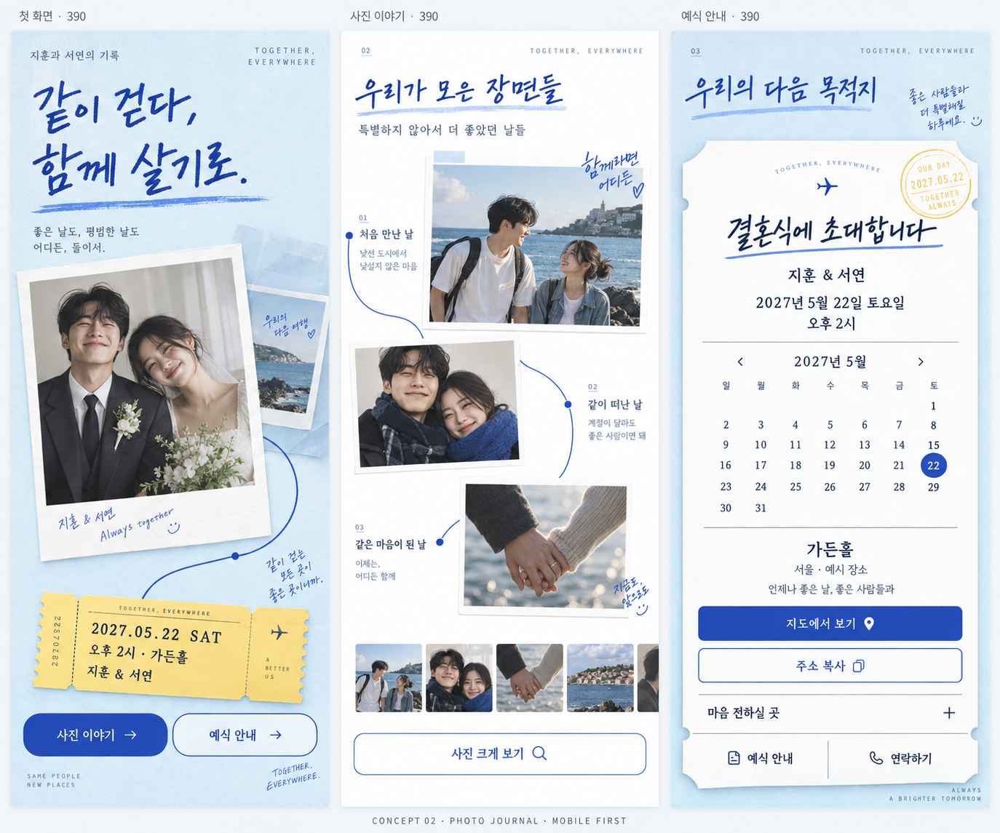
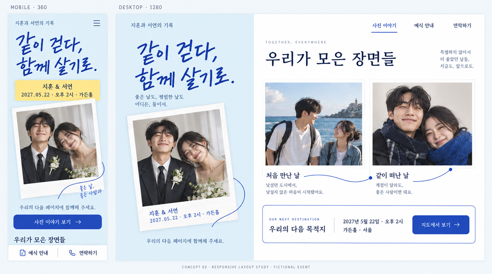
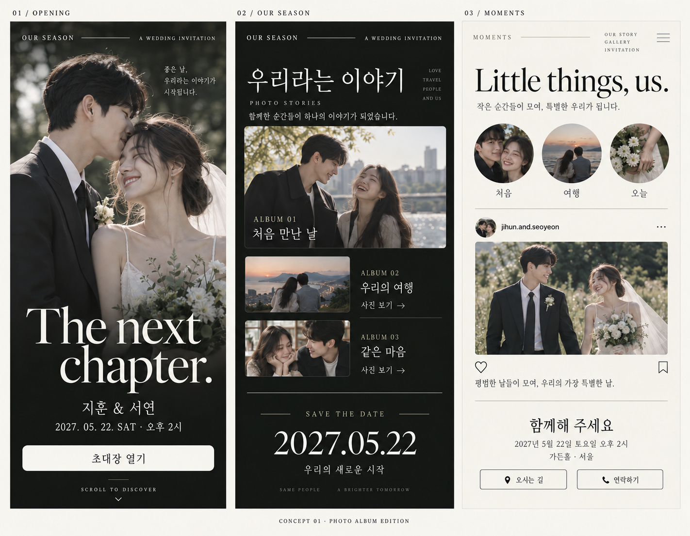

# 모바일 청첩장 시안

[조사 목차로 돌아가기](../README.md)

## 구현 기준 — Concept 01 사진 앨범 v2

사용자가 이 시안을 선택해 [실제 로컬 사이트](../../README.md)를 구현했다. 아래 이미지들은 디자인 검토 기록이며, 실제 사이트는 `npm run dev`로 실행한다. 현재 사진 자산의 [생성 기록](site-assets.md)도 보관했다.

실제 브라우저 캡처: [PC](implementation-desktop.png) · [모바일 전체](implementation-mobile.png).

2026-09-22 후속 구현: 표지 장소 표시, 이야기 앨범과 전체 갤러리 분리, 전체 사진 보기 버튼을 반영해 캡처를 갱신했다. [모바일 표지](implementation-mobile-cover.png)도 별도로 확인할 수 있다.

## Concept 02 — 둘만의 사진 기록장 (2026-09-22)

새 디자인 제안이다. 사진과 짧은 글을 파란 선으로 연결하고, 손글씨 제목과 날짜 띠로 두 사람의 기록장 같은 분위기를 만든다. 실제 커플의 여행 취향을 가정한 확정안은 아니며, 여행 사진이 없으면 일상 사진 기록장으로 바꿀 수 있다.

### 모바일 화면 구성 탐색

표지, 사진 이야기, 예식 안내의 세 구간이다. 이 초기 탐색에서 나온 작은 메모와 항공권 모양 장식은 다음 반응형 배치에서 줄였다.

### 반응형 배치 제안

- **모바일**: 제목 → 이름·날짜·장소 → 대표 사진 순서. 사진과 이야기는 한 열로 이어지고 하단에 예식 안내·연락하기를 둔다.
- **태블릿**: 읽기 좋은 본문 폭을 유지하고, 충분한 공간에서 사진 카드만 두 열로 배치한다.
- **PC**: 표지와 사진 이야기를 나란히 배치하고 하단 메뉴를 상단 링크로 전환한다.

현재 Concept 02의 정보 우선순위는 이 반응형 시안을 따른다. 이미지의 화면 폭 표시는 목표값이며 실제 기기에서 테스트한 화면은 아니다. [반응형 설계](../responsive-design.md)에 폭별 배치, 글자 크기, 한 손 조작, 사진 로딩, 구현 후 검증 항목을 기록했다.

인물·이름·일정·여행 이야기는 가상의 예시다. 두 시안 모두 정지 사진만 사용하며 동영상은 필요 없다.

생성 방식: 내장 `image_gen` 도구. [모바일 시안 프롬프트](./concept-02-mobile-prompt.md)와 [반응형 시안 프롬프트](./concept-02-responsive-prompt.md)를 함께 보관했다.

## Concept 01 — OUR SEASON · 사진 앨범 버전 (2026-09-22)

사용자가 최종 선택한 SNS·OTT 기반 사진 앨범 시안이다.

한 사이트의 세 구간을 나란히 보여 주는 이미지 시안이다.

1. **OPENING**: 커플 사진을 크게 배치한 영화 포스터형 표지.
2. **OUR SEASON**: 처음 만난 날과 여행 등을 사진 앨범 카드로 표현. 카드를 누르면 정지 사진과 짧은 이야기를 연다.
3. **MOMENTS**: SNS 스토리·사진 피드와 밝은 예식 안내 화면.

차콜·아이보리·올리브 색상과 큰 세리프 제목을 공통으로 사용한다. 실제 웹 구현에서는 세 구간이 모바일 세로 스크롤로 이어지며, 화면 크기에 따라 사진과 글자 크기를 조절한다.

이미지 속 인물은 AI가 생성한 가상의 성인 커플이며, 지훈·서연이라는 이름과 2027년 5월 22일 예식 정보도 시안용 예시다. 실제 사이트나 반응형 동작을 구현한 결과는 아니다. 생성 이미지의 글자와 아이콘은 구현 시 실제 텍스트와 UI로 다시 만든다.

커플 동영상은 없으며 사진만 사용한다. 초기 시안에서 동영상처럼 보이던 재생 아이콘을 모두 제거하고 `ALBUM`, `사진 보기`로 수정했다. 표지의 움직임은 정지 사진의 CSS 확대·페이드로 구현하며, 앨범과 SNS 스토리 모두 사진과 글로 구성한다. 영상 제작이나 동영상 파일 준비는 필요하지 않다.

실제 구현에서 하트는 해당 브라우저의 마음 표시, 북마크는 캘린더 일정 다운로드로 동작한다. QR은 최종 배포 URL이 확정된 뒤 실제 스캔 가능한 파일로 생성한다.

생성·수정 방식: 내장 `image_gen` 도구. [사진 전용 수정 프롬프트](./concept-01-photo-album-v2-prompt.md)에 변경 지시를 기록했다.

초기 자료: [이전 이미지](./concept-01-ott-social.png)와 [초기 프롬프트](./concept-01-prompt.md)는 비교용으로 보관한다. 실제 구현은 사진 앨범 v2를 기준으로 한다.
